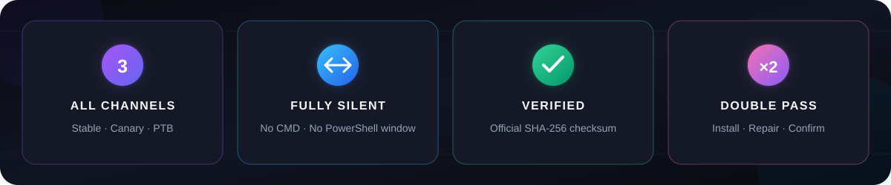
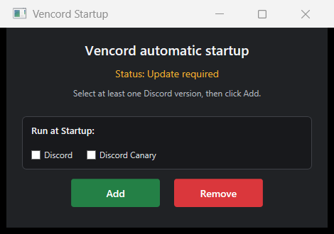

<p align="center">
  
</p>

<p align="center">
  
  
  
  
</p>

<h3 align="center">تثبيت Vencord تلقائياً — بصمت، بأمان، وعلى جميع نسخ Discord</h3>

<p align="center" dir="rtl">
  أداة خفيفة لويندوز تكتشف Discord العادي وCanary وPTB، وتنزّل مُثبّت Vencord الرسمي،<br>
  وتتحقق من سلامته، ثم تنفّذ جولتي تثبيت وإصلاح لكل نسخة موجودة — بدون نافذة CMD.
</p>

<p align="center">
  
</p>

---

## ✦ لماذا هذه الأداة؟

<table dir="rtl">
  <tr>
    <td width="50%"><strong>🌑 تشغيل مخفي بالكامل</strong><br>لا تظهر نافذة CMD أو PowerShell أثناء التثبيت أو التشغيل التلقائي.</td>
    <td width="50%"><strong>🎯 اكتشاف ذكي</strong><br>تعمل فقط على نسخ Stable وCanary وPTB الموجودة فعلياً على الجهاز.</td>
  </tr>
  <tr>
    <td><strong>🛡️ تحقق أمني</strong><br>تطابق بصمة SHA-256 للمُثبّت مع ملف البصمات المنشور رسمياً.</td>
    <td><strong>⚡ جولتان لكل نسخة</strong><br>الجولة الثانية تعيد التثبيت والإصلاح للتأكد من اكتمال العملية.</td>
  </tr>
</table>

## 🚀 التثبيت اليدوي السريع

1. شغّل **`Install Vencord Hidden.vbs`** بنقرتين.
2. انتظر في الخلفية؛ قد يُغلق Discord تلقائياً أثناء تعديل ملفاته.
3. سيظهر إشعار صغير عند انتهاء العملية.
4. افتح إعدادات Discord وتحقق من ظهور قسم **Vencord**.

> [!IMPORTANT]
> شغّل الأداة كمستخدم عادي. لا تستخدم **Run as administrator**.

<p align="center">
  
</p>

## 🖥️ واجهة Startup

<p align="center">
  
</p>

<table dir="rtl">
  <tr>
    <td width="50%" align="center">
      <h3>🟢 Add</h3>
      ينسخ ملفات التشغيل إلى مكان دائم، ثم يضيف التشغيل المخفي إلى Startup.
    </td>
    <td width="50%" align="center">
      <h3>🔴 Remove</h3>
      يزيل اختصار Startup وملفات الأداة الدائمة، من دون إزالة Vencord من Discord.
    </td>
  </tr>
</table>

### طريقة الإضافة إلى Startup

1. افتح **`Startup.vbs`** — الواجهة تظهر مباشرة ومن دون انتظار PowerShell.
2. تحت **Run at Startup** ستظهر فقط نسخ Discord المثبّتة فعلياً على الجهاز. الخانات تحدد أي تطبيق Discord يُفتح بعد انتهاء تثبيت Vencord، وليست لاختيار نسخ التثبيت.
3. جميع الخانات غير محددة افتراضياً، ويمكن تركها كلها فارغة. اضغط **Add** لحفظ الاختيارات.
4. تُنسخ الملفات الضرورية تلقائياً إلى:

   ```text
   %LOCALAPPDATA%\VencordAutoInstaller
   ```

5. بعد ظهور حالة **Added to Startup** يمكنك حذف مجلد التنزيل بالكامل.
6. عند تسجيل الدخول إلى ويندوز، تثبّت الأداة Vencord بصمت على جميع نسخ Discord الموجودة، ثم تفتح فقط تطبيقات Discord المحددة في الواجهة. إذا لم تحدد شيئاً فلن يُفتح Discord تلقائياً.

عند التشغيل مع ويندوز، تنتظر الأداة بصمت حتى يصبح GitHub متاحاً عبر الإنترنت، وتعيد الفحص كل 5 ثوانٍ، ثم تبدأ التثبيت تلقائياً. لا يوجد حد زمني للانتظار ولا تظهر نافذة أثناءه.

عند الضغط على **Add**، تُضبط عناصر Startup الأصلية الخاصة بـDiscord وDiscord Canary وDiscord PTB على **Disabled** في Task Manager، سواء كانت النسخ الثلاث مثبتة أم لا. بعد اكتمال تثبيت Vencord، يشغّل المساعد فقط تطبيقات Discord المحددة في الخانات. وبعد فتحها ينتظر 10 ثوانٍ ثم يعيد تعطيل القيود الثلاثة، لمنع Discord من إعادة تفعيلها. زر **Remove** لا يعيد تفعيل Startup الخاص بـDiscord.

> [!TIP]
> زر **Remove** يوقف التشغيل التلقائي ويحذف ملفات المساعد فقط؛ Vencord المثبّت داخل Discord يبقى كما هو.

## ⚙️ ماذا يحدث في الخلفية؟

```text
Detect Discord versions
          ↓
Download official Vencord Installer
          ↓
Verify published SHA-256 checksum
          ↓
Install pass 1 → Repair pass 2
          ↓
Save result to Vencord-Install.log
```

التنفيذ متتالٍ وليس متزامناً على النسخة نفسها، لمنع تعارض عمليتين أثناء تبديل ملفات `app.asar` و`_app.asar`.

## 🔐 الأمان والخصوصية

- التنزيل يتم من [مستودع Vencord Installer الرسمي](https://github.com/Vencord/Installer/releases/latest).
- لا تُرسل الأداة بيانات شخصية ولا تحتاج كلمة مرور Discord.
- لا تثبّت تعريفات Drivers ولا تعدّل ملفات نظام ويندوز.
- تعمل بصلاحيات المستخدم الحالي فقط.
- الملفات المؤقتة للمُثبّت والبصمة تُحذف بعد الانتهاء.
- تفاصيل النجاح أو الخطأ تُحفظ محلياً في **`Vencord-Install.log`**.

## 📦 ملفات المشروع

| الملف | الوظيفة |
|---|---|
| `Install Vencord Hidden.vbs` | المشغّل المخفي للتثبيت والإصلاح |
| `Install-Vencord-All.ps1` | اكتشاف Discord، التنزيل، التحقق، وتنفيذ الجولتين |
| `Startup.vbs` | فتح واجهة إدارة Startup السريعة |
| `Startup-Manager.hta` | واجهة Add وRemove الداكنة |
| `Vencord-Install.log` | سجل آخر عملية تشغيل، ويظهر بعد تشغيل الأداة |

## 🧪 اختبار آمن بدون تعديل Discord

افتح PowerShell داخل المجلد وشغّل:

```powershell
.\Install-Vencord-All.ps1 -DryRun -Passes 2
```

هذا الوضع يختبر اكتشاف نسخ Discord، وتنزيل المُثبّت، والتحقق من بصمته، من دون تثبيت أو تعديل أي ملف في Discord.

## 🧩 عند حدوث مشكلة

1. تأكد أن اتصال الإنترنت يعمل وأن GitHub غير محجوب.
2. أغلق Discord بالكامل ثم أعد تشغيل **`Install Vencord Hidden.vbs`**.
3. راجع ملف **`Vencord-Install.log`** لمعرفة النسخة أو الجولة التي فشلت.
4. إذا نقلت ملفات التنزيل قبل الضغط على Add، افتح `Startup.vbs` من موقعها الجديد واضغط Add مرة أخرى.

---

<p align="center" dir="rtl">
  <strong>Vencord Auto Installer</strong><br>
  داكن، سريع، وصامت — مصنوع لتثبيت أقل إزعاجاً.
</p>

> [!WARNING]
> Vencord تعديل غير رسمي لبرنامج Discord وقد يخالف شروط خدمة Discord. استخدامه يقع على مسؤولية المستخدم.
